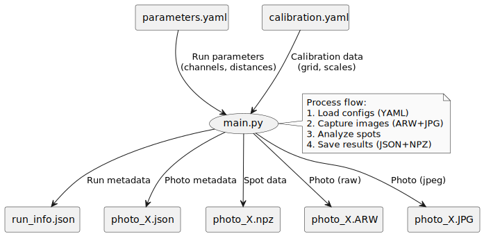

# spot_analysis

This repository contains a simple sqlite3 data base in Python, and required python apps to manage it, retrive data from it and analyze the data. 

Its purpose is to be a database and analysis toolset for the photos taken with the [camera_control](https://github.com/luanviko/camera_control) repository.

The image was retrieved from the SQL database then analyzed with Python. [Please check out the animation!](spot_animation.mp4)


## Repository Structure

```utils``` contains the classes used by the apps on the main tree.

```text
.
├── utils
│   ├── __init__.py 
│   ├── db_tools.py
│   └── jasper.py
├── db_manager.py
├── offline_analisys.py
├── photos.sqlite
├── README.md
└── release_jasper.py
```

## Description

* ```.utils.db_tools.py```: Contains the ```Database``` class, to set up, update and query the SQL database. 

* ```.utils.jasper.py```: Contains the under-construction ```Jasper``` class, my watch dog, to automatically add photos taken with ```camera_control``` app to this database.

* ```.offline_analysis.py```: A bunch of customized visualization tools to analyze the photos in the database.

* ```.db_manager.py```: An example app, invoking the methods in ```Database``` to retrieve tables and add a photo.

* ```.release_jasper.py```: An example app on how to start Jasper and fetch photos; still under construction.


## Database

The SQL database is built around taking photos and adding their metadata to it.



You can manually add a photo to the database by importing its json file. The ```Database``` class can decode the json file and add a new photo the ```photos``` table as illustrated in the ```Database:add_photo()``` method [through this link.](https://github.com/luanviko/spot_analysis/blob/18267f86b3036f681b8b2bb0d5f3b212554bb4cc/utils/db_tools.py#L129)


## Generative AI Disclaimer

This work uses chatGPT and deepseek to organize and refactor code, add docstrings, and anotate variable types and returns (the boring stuff). Humans have developed the algorithms and plots (the cool stuff, of course).


## Acknowledgements 

The algorithms to find contours and prepare the blurred images are built upon Xiaoyue Li's algorithms.